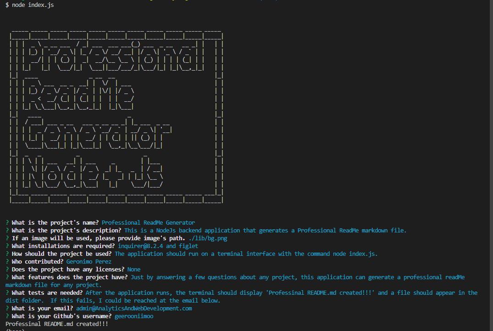

# Professional ReadMe Generator

## Description
This is a NodeJs backend application that generates a Professional ReadMe markdown file.

## Table of Contents
- [Installation](#installation)
- [Usage](#usage)
- [Credits](#credits)
- [License](#license)
- [Features](#features)
- [Tests](#tests)
- [Contact](#contact)

## Installation
inquirer@8.2.4 and figlet

## Usage
The application should run on a terminal interface with the command node index.js.

## Credits
Geronimo Perez

## Features
Just by answering a few questions about any project, this application can generate a professional readMe markdown file for any project.

## Tests
After the application runs, the terminal should display 'Professinal README.md created!!!' and a file should appear in the dist folder.  If this fails, I could be reached at the email below.

## Contact
### If there are any questions of concerns, I can be reached at:
[Email](mailto:admin@AnalyticsAndWebDevelopment.com)
[Github](https://github.com/geerooniimoo)