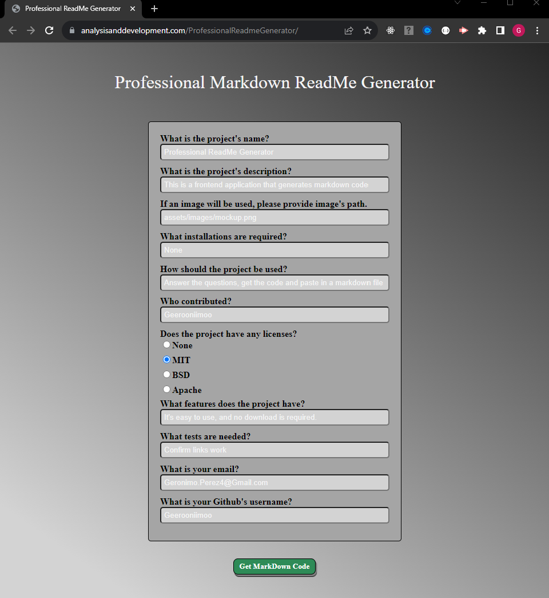

# Professional Markdown ReadMe Generator

## Website: 
[website](https://analysisanddevelopment.com/ProfessionalReadmeGenerator/)

## Description
It can quickly generate a professional markdown readme file with a table of content, images and navigating links.

## Table of Contents

- [Usage](#usage)
- [Credits](#credits)
- [License](#license)
- [Features](#features)
- [Tests](#tests)
- [Contact](#contact)

## Usage
Answer the questions that relate to your project.

## Credits
Geronimo Perez

## License
MIT

## Features
It provides a readme file with links, images and description of a project.

## Tests
Confirm markdown code was provided.

## Contact
If there are any questions of concerns, I can be reached at:
##### [github: Geerooniimoo](https://github.com/Geerooniimoo)
##### [email: Geronimo.Perez4@Gmail.com](mailto:Geronimo.Perez4@Gmail.com)
